# NH-Guardian

**AI 상시 보안 점검 체계** — 서버·레포지토리 자산을 한 번 등록하면, KISA·CIS 기준 보안 점검부터 AI 분석 보고서, 실시간 CVE 감시, 경영진·PM 공유까지 전 과정이 자동으로 돌아가는 자산 중심 보안 점검 플랫폼입니다.

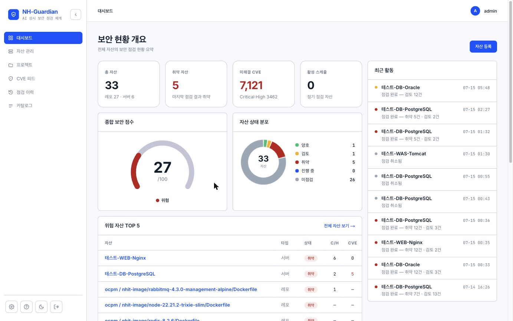

---

## 목차

- [왜 NH-Guardian인가](#왜-nh-guardian인가)
- [주요 기능](#주요-기능)
  - [1. 보안 현황 대시보드](#1-보안-현황-대시보드--조직-전체를-한-화면에)
  - [2. 자산 관리 (수동 등록 · 레포 가져오기 · 엑셀 일괄 업로드)](#2-자산-관리--서버레포지토리를-한-곳에서)
  - [3. 자산 상세 허브](#3-자산-상세-허브--자산-하나의-모든-것)
  - [4. 점검 실행 (카테고리 선택 · SSH/컨테이너 파이프라인 · 일괄 점검)](#4-점검-실행--카테고리를-골라-필요한-만큼만)
  - [5. 점검 카탈로그 (KISA·CIS 186항목)](#5-점검-카탈로그--어떤-기준으로-점검하는지-투명하게)
  - [6. AI 분석 보고서](#6-ai-분석-보고서--raw-로그가-아니라-조치-가능한-문서)
  - [7. 점검 이력](#7-점검-이력--자산별-추세를-한눈에)
  - [8. CVE 실시간 감시](#8-cve-실시간-감시--점검하지-않는-날에도-지켜봅니다)
  - [9. 프로젝트와 공유 (보안 점수 · QR · 읽기 전용 리포트)](#9-프로젝트와-공유--결과가-필요한-사람에게-안전하게)
  - [10. 온보딩 투어 · 다크 모드](#10-처음-써도-헤매지-않게)
- [동작 구조](#동작-구조)
- [기술 스택](#기술-스택)
- [시작하기](#시작하기)
- [보안 설계](#보안-설계)
- [문서](#문서)
- [상태](#상태)

---

## 왜 NH-Guardian인가

보안 담당자의 하루는 이렇게 흘러갑니다. 여러 프로젝트에 흩어진 수십 대의 서버와 컨테이너 이미지를 사람 손으로, 담당자마다 다른 기준으로 점검합니다. 점검 스크립트가 뱉어낸 raw 로그를 해석해 보고서로 정리하는 데 또 하루가 갑니다. 그렇게 한 번 점검하고 나면 끝 — 다음 점검 전까지 새로 공개되는 취약점(CVE)은 아무도 지켜보지 않고, 결과를 프로젝트 책임자에게 전달할 표준 경로도 없습니다.

NH-Guardian은 이 과정 전체를 하나의 플랫폼으로 통합합니다.

- **점검 자동화** — 서버는 SSH로, 레포지토리는 Docker 샌드박스로 자동 점검. 186개 점검 항목(KISA 주요정보통신기반시설 가이드 + CIS Benchmark)을 몇 분 안에 수행합니다.
- **AI가 해석까지** — Claude AI가 점검 증거(evidence)를 근거로 판정 이유·위험도·조치방안·설정 예시를 실무에 바로 쓸 수 있는 한국어 보고서로 만들어 줍니다.
- **한 번 등록하면 상시 감시** — 정기 점검 스케줄이 자동으로 돌고, 서버에 설치된 패키지를 NVD(미국 국립 취약점 DB)와 상시 대조해 새 CVE가 공개되는 즉시 알려줍니다.
- **결과 공유는 링크 하나로** — 비밀번호로 보호된 공유 링크(QR 코드 지원)를 통해 보안 지식이 없는 프로젝트 책임자도 자기 프로젝트의 보안 점수와 상세 리포트를 읽기 전용으로 열람합니다.

숫자로 요약하면: **점검 항목 186개 · 벤더 팩 13종(OS/컨테이너/웹/WAS/DB/Windows) · 자동화된 테스트 1,159개 통과.**

---

## 주요 기능

### 1. 보안 현황 대시보드 — 조직 전체를 한 화면에

앱을 열면 가장 먼저 보이는 화면입니다. 전체 자산 수, 취약 자산, 미해결 CVE, 활성 스케줄 등 핵심 지표와 함께 **종합 보안 점수(0~100)** 게이지가 조직의 현재 보안 수준을 즉시 보여줍니다.

- 자산 상태 분포 도넛 차트(양호/검토/취약/진행 중/미점검)
- 위험 자산 TOP 5 — 어떤 자산부터 손대야 하는지 우선순위 제시
- 최근 7일 신규 CVE 경보 및 고위험 CVE TOP 5
- 최근 점검 활동 피드

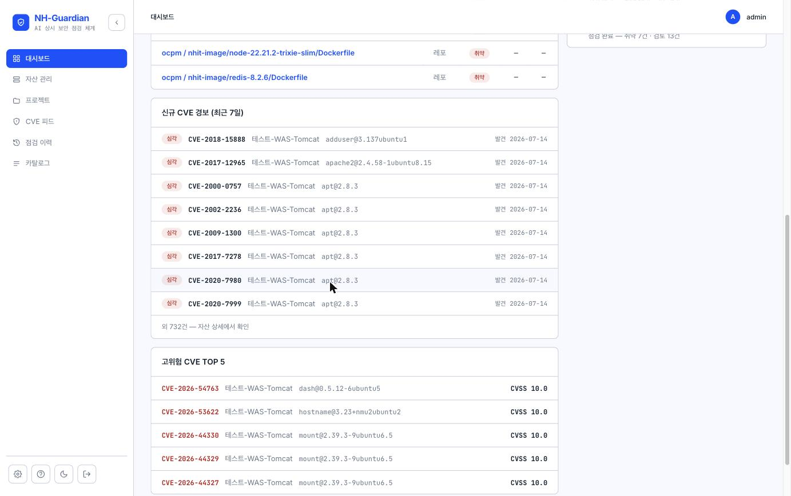

### 2. 자산 관리 — 서버·레포지토리를 한 곳에서

점검 대상을 "자산"으로 등록해 관리합니다. 서버(SSH 접속 정보)와 레포지토리(GitHub URL) 두 유형을 지원하고, 각 자산은 OS / WEB / WAS / DB / Windows 종류로 분류되어 종류에 맞는 점검 항목이 자동으로 매칭됩니다.

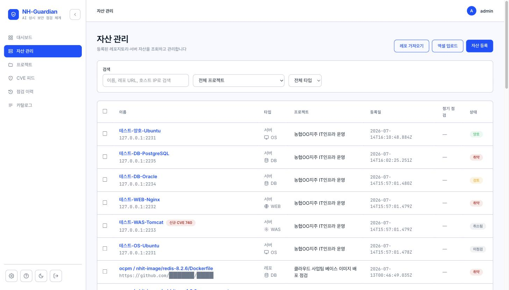

자산 등록은 규모와 상황에 맞게 세 가지 경로를 제공합니다.

**① 수동 등록** — 서버는 호스트 IP·SSH 포트·인증 방식(비밀번호/SSH 키)·OS·종류·담당자를, 레포는 GitHub URL을 입력해 한 건씩 등록합니다. SSH 접속 정보는 AES-256-GCM으로 암호화 저장되며, 화면·로그·AI 입력 어디에도 평문으로 노출되지 않습니다.

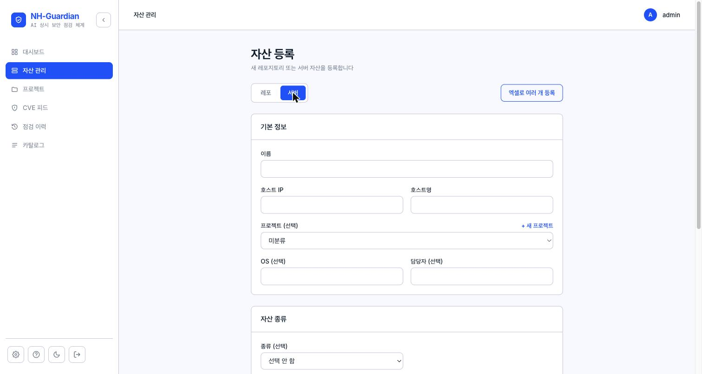

**② 깃헙 레포 링크 등록(레포 가져오기)** — 레포 URL 하나를 입력하고 "발견"을 누르면 NH-Guardian이 레포를 클론해 안에 있는 **모든 Dockerfile을 자동 탐지**합니다. 아래 화면처럼 수십 개의 베이스 이미지 Dockerfile이 목록으로 나오고, 원하는 것만 선택하면 이미지별 개별 자산으로 만들어져 하나의 프로젝트로 묶입니다. 이후 프로젝트 일괄 점검으로 전체 이미지를 한 번에 점검하고, 정기 점검 스케줄을 걸어 두면 등록된 레포 자산이 지속적으로 추적 관리됩니다. 이미 등록된 Dockerfile은 "이미 등록됨" 배지와 소속 프로젝트 링크로 표시되어(중복 등록 차단) 레포에 이미지가 추가될 때마다 재발견으로 새 항목만 골라 넣을 수 있습니다.

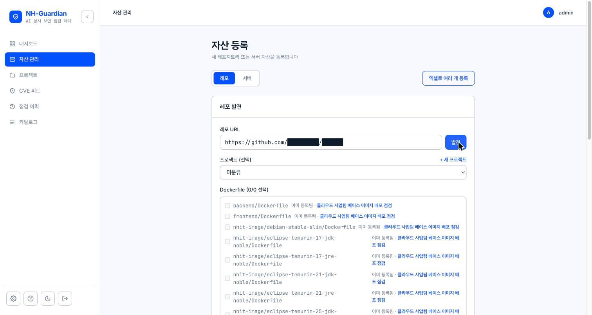

**③ 엑셀 일괄 업로드** — 예시 엑셀 템플릿(`asset-upload-template.xlsx`)을 내려받아 `repo`/`server` 두 시트에 자산을 채워 올리면, 아래 양식 그대로 행마다 자산이 **자동 등록**됩니다. 행 단위 best-effort로 처리되어 일부 행에 오류가 있어도(필수값 누락, 중복 등) 해당 행만 사유와 함께 실패하고 나머지는 정상 등록됩니다.

`repo` 시트 — 레포지토리 자산:

| display_name (필수) | repo_url (필수) | os | owner |
|---|---|---|---|
| nh-pay-gateway | https://github.com/nh/pay-gateway | | |

`server` 시트 — 서버 자산:

| display_name (필수) | host_ip (필수) | hostname (필수) | ssh_port (필수) | auth_type (필수) | username (필수) | secret (필수) | os | owner | category | vendor |
|---|---|---|---|---|---|---|---|---|---|---|
| web-01 | 10.0.0.5 | web-01.internal | 22 | password | admin | changeme | Ubuntu 22.04 | 홍길동 | WEB | Nginx |

- `auth_type`은 `password` 또는 `key`(SSH 키), `secret`에는 비밀번호 또는 키 본문을 넣습니다 — 업로드 즉시 AES-256-GCM으로 암호화 저장됩니다
- `category`(OS/WEB/WAS/DB/WINDOWS)와 `vendor`(Nginx, Tomcat, MySQL 등)를 채우면 해당 벤더 팩 점검 항목이 자동 매칭됩니다
- `ssh_port`는 양의 정수만 허용, 잘못된 값은 행별 오류 사유로 안내됩니다

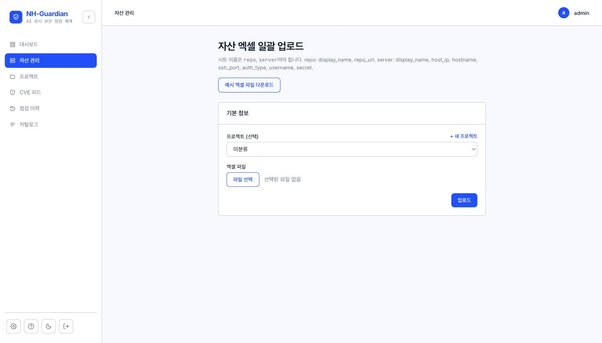

공통으로 레포는 정규화 URL(+Dockerfile 경로), 서버는 IP+포트 조합의 중복 자동 차단이 적용됩니다.

### 3. 자산 상세 허브 — 자산 하나의 모든 것

자산을 클릭하면 점검 실행, 정기 점검 설정, 감지된 CVE, 점검 이력이 한 화면에 모입니다. "이 서버 지금 어떤 상태지?"라는 질문에 이 화면 하나로 답합니다.

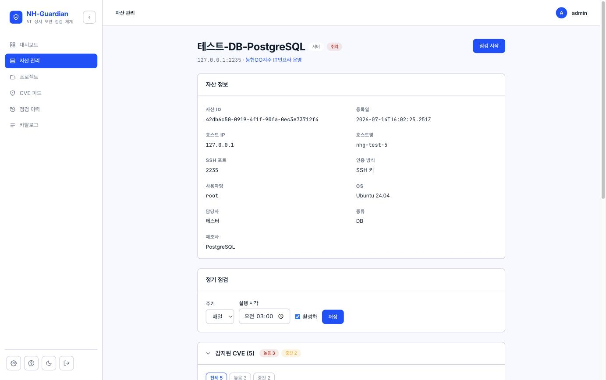

정기 점검은 매일/매주/매월 주기와 실행 시각만 고르면 됩니다. 서버가 꺼져 있던 동안 놓친 스케줄은 재기동 시 자동으로 따라잡아(catch-up) 실행됩니다. 감지된 CVE는 심각도별 필터와 함께 한국어로 번역된 요약을 보여주고, 오탐은 "무시" 처리할 수 있습니다.

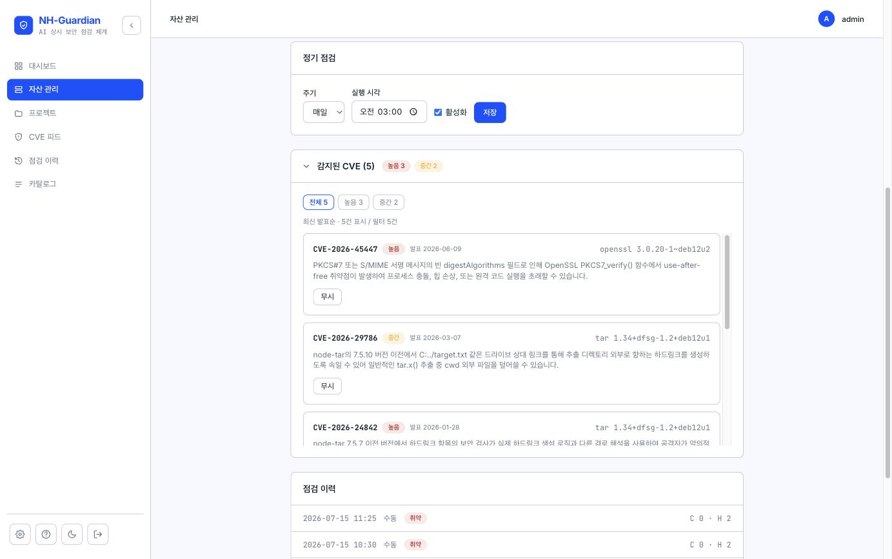

### 4. 점검 실행 — 카테고리를 골라 필요한 만큼만

점검 시작 시 자산에 해당하는 점검 카테고리(OS/WEB/WAS/DB/Windows/컨테이너)를 선택할 수 있어, 대상 항목과 소요 시간을 줄일 수 있습니다. 이 카테고리 선택은 자산 상세·자산 목록·리포트 재점검·CVE 재스캔 등 모든 점검 진입점에서 동일하게 동작합니다.

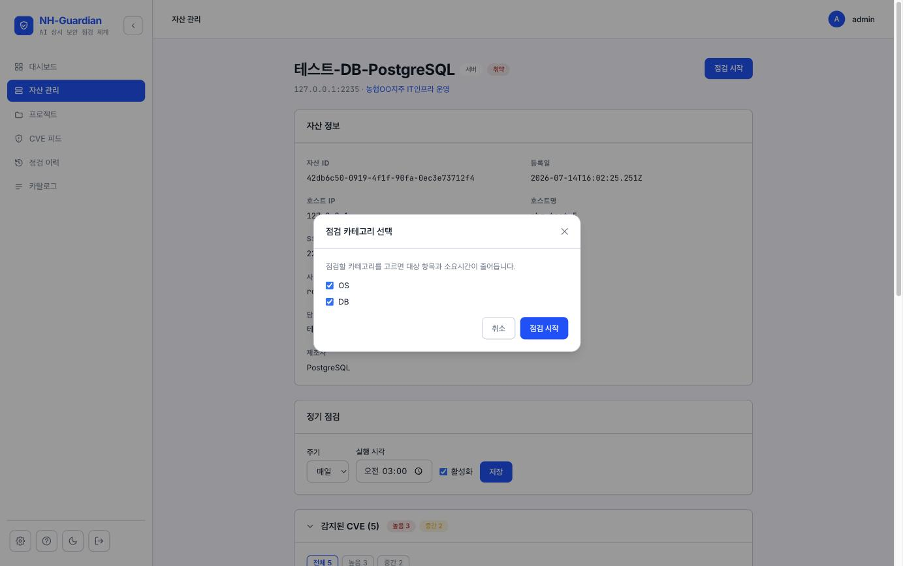

내부적으로 두 종류의 점검 파이프라인이 동작합니다.

- **서버 점검**: `연결(SSH) → Ansible 점검 → 룰 평가 → AI 분석 → 완료`. 비밀번호/SSH 키 인증을 모두 지원하고, 연결 실패는 30초 간격 자동 재시도, 인증 실패는 자격증명 노출 없이 즉시 실패 처리합니다.
- **레포(컨테이너) 점검**: `클론 → Docker 빌드 → 샌드박스 기동 → Ansible 점검 → 룰 평가 → AI 분석 → 완료`. 클론/빌드가 불가능한 폐쇄망 환경에서는 로컬 Docker 이미지로 샌드박스 단계부터 재개하는 폴백을 제공합니다. 샌드박스는 10분 수명 제한으로 강제 정리되고, 일회용 빌드 이미지는 자동 삭제됩니다.

프로젝트 단위 **일괄 점검(fleet scan)** 은 최대 5대를 동시에 점검하며, 한 서버의 실패가 배치 전체를 중단시키지 않도록 격리됩니다.

### 5. 점검 카탈로그 — 어떤 기준으로 점검하는지 투명하게

점검 항목 전체(186개)를 프레임워크·카테고리·심각도·자동화 여부로 탐색할 수 있는 참조 화면입니다. "우리 점검이 어떤 근거로 이뤄지는가"에 대한 답이기도 합니다.

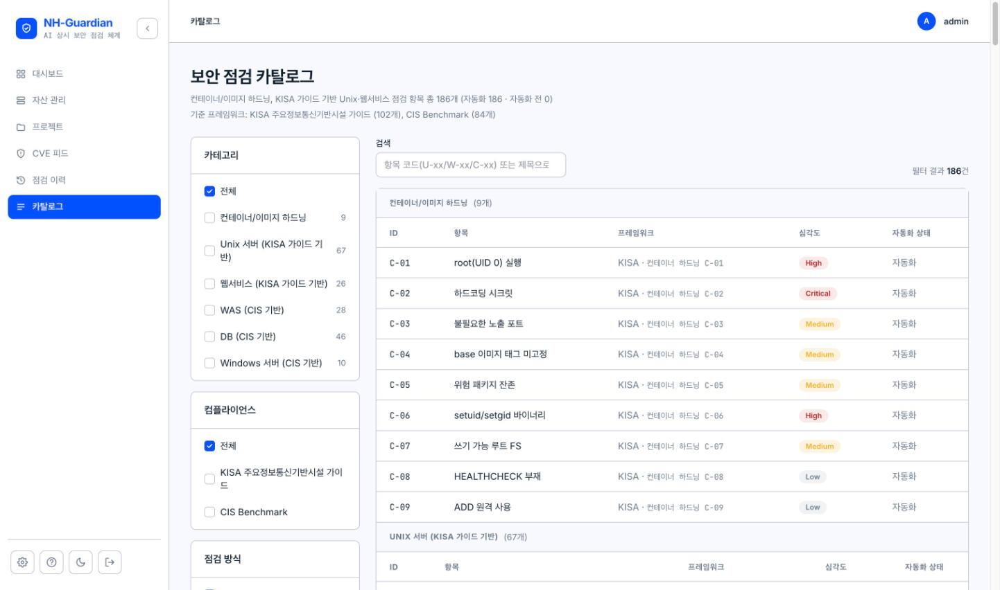

| 프레임워크 | 카테고리 | 항목 수 |
|---|---|---|
| KISA 주요정보통신기반시설 가이드 | Unix 서버 (U-01~U-67) | 67 |
| KISA 주요정보통신기반시설 가이드 | 웹서비스 (WEB-01~WEB-26) | 26 |
| KISA 주요정보통신기반시설 가이드 | 컨테이너/이미지 하드닝 (C-01~C-09) | 9 |
| CIS Benchmark | DB (MySQL·PostgreSQL·Oracle·MSSQL) | 46 |
| CIS Benchmark | WAS (Tomcat·WebLogic·WebSphere) | 28 |
| CIS Benchmark | Windows 서버·IIS | 10 |

점검 룰은 Nginx, Apache, Tomcat, MySQL, PostgreSQL, Oracle, IIS, MSSQL, WebLogic, WebSphere 등 **13종 벤더 팩**으로 구현되어 있고, 새 프레임워크·벤더 추가는 JSON 데이터 파일과 레지스트리 등록만으로 가능합니다.

### 6. AI 분석 보고서 — raw 로그가 아니라 조치 가능한 문서

점검이 끝나면 항목별 판정(양호/취약/검토)과 심각도 요약이 담긴 보고서가 생성됩니다. 각 항목을 클릭하면 Claude AI가 작성한 **판정 근거 → 증거(evidence) → 조치방안 → 설정 예시**가 이어집니다. 담당자가 그대로 복사해 적용할 수 있는 수준의 구체성이 목표입니다.

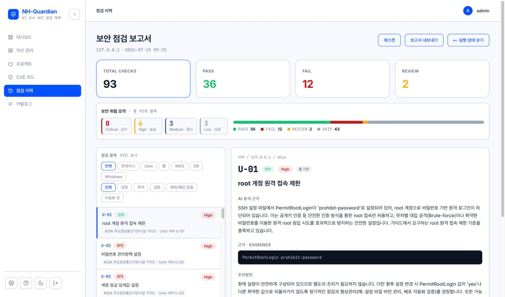

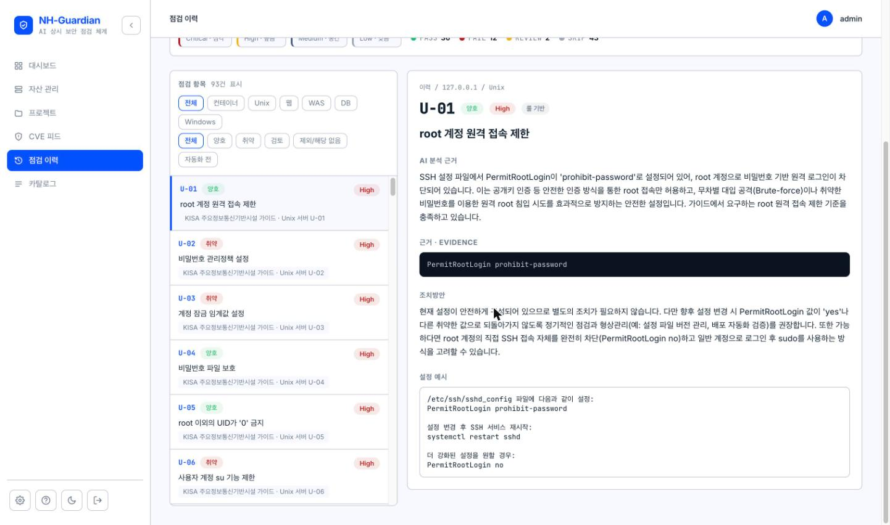

중요한 설계 원칙: **AI는 판정하지 않습니다.** 판정은 Ansible이 수집한 증거에 정적 룰을 적용해 산출하고, AI는 그 결과를 해석·설명하는 역할만 합니다(증거가 애매한 항목에 한해 AI가 양호/취약 보정 판단을 돕는 검토 단계가 있습니다). AI 입력 전에는 민감정보가 sanitize되며, `CLAUDE_ANALYSIS_ENABLED` 설정으로 AI 단계를 켜고 끌 수 있습니다. 보고서는 CSV로 내보낼 수 있고, 보고서 화면에서 바로 재점검을 실행할 수 있습니다.

### 7. 점검 이력 — 자산별 추세를 한눈에

모든 점검 실행이 자산별로 누적됩니다. 심각도 요약(심각/높음/중간/낮음), 수동/예약 트리거 구분, 소요 시간, 결과 상태를 비교하며 "지난주보다 나아졌는가"를 확인합니다.

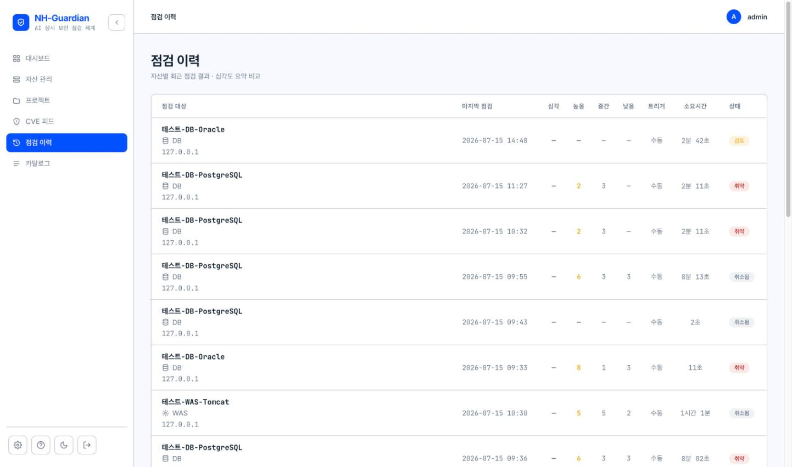

### 8. CVE 실시간 감시 — 점검하지 않는 날에도 지켜봅니다

서버에 설치된 패키지 목록을 주기적으로 수집해 NVD와 대조하고, NVD 델타 피드를 실시간으로 수집(LIVE)해 새로 공개된 CVE 중 **우리 자산에 실제 영향이 있는 것만** 골라냅니다. 고위험(CVSS ≥ 7.0) 매칭은 Claude가 영향·조치를 한국어로 분석하고, 새 매칭이 생기면 화면에 실시간 토스트로 알립니다.

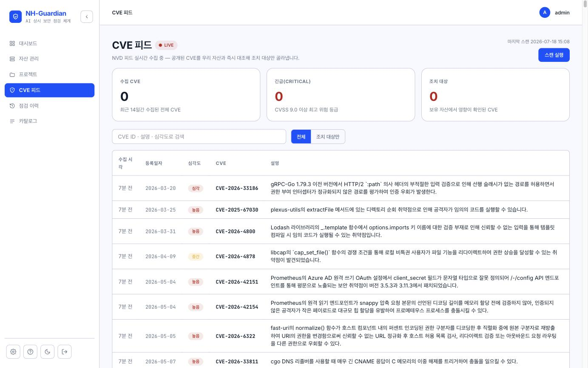

CVE 상세 화면은 영향받는 자산 목록과 배포판별 조치 가이드(apt/yum 업그레이드 명령)를 제공하며, 조치 후 해당 자산만 골라 바로 재스캔할 수 있습니다.

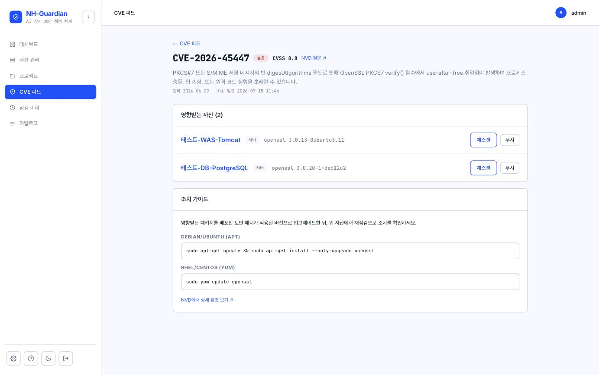

> **감지된 CVE가 많은 자산은 첫 조회 시 한국어 번역이 잠시 걸릴 수 있습니다.** CVE 영문 요약의 한국어 번역은 미리 일괄 생성해 두는 것이 아니라 **조회 시점에 번역 캐시에 없는 항목만 Claude API로 그때그때 번역**하는 구조이기 때문입니다. 캐시 미스분(조회당 최대 30건)은 한 번의 배치 호출로 묶어 번역하고, 배치가 실패할 때만 항목별 순차 번역으로 폴백합니다. 번역 결과는 DB에 영구 캐시되므로 같은 CVE는 두 번째 조회부터 즉시 한국어로 표시되고, 한 번에 30건을 넘는 미번역분은 우선 영문으로 표시됐다가 이후 조회에서 점진적으로 채워집니다. 서버 기동 시에는 CVSS 높은 순 상위 500건을 미리 백필해 자주 보는 고위험 CVE부터 한국어로 준비해 둡니다. AI 분석이 꺼져 있으면(`CLAUDE_ANALYSIS_ENABLED=false`) 새 번역은 시도하지 않고 캐시된 번역 + 영문 폴백으로만 동작합니다.

### 9. 프로젝트와 공유 — 결과가 필요한 사람에게 안전하게

자산을 프로젝트로 묶고 담당 PM 연락처를 등록합니다. 프로젝트 화면에서 **공유 링크**를 발급하면, PM은 계정 없이 링크+비밀번호만으로 자기 프로젝트의 종합 보안 점수 게이지와 자산별 풀 리포트를 읽기 전용으로 열람합니다. 모바일 전달용 QR 코드도 즉석에서 생성되고, **"PM에게 메일로 보내기" 버튼**을 누르면 등록된 PM 이메일로 공유 링크가 담긴 메일 작성창이 바로 열립니다 — 열람 비밀번호는 보안을 위해 메일 본문에 포함하지 않으며(링크와 비밀번호가 한 채널에 있으면 메일 유출만으로 열람이 가능해지므로) 별도 채널로 전달하도록 안내합니다.

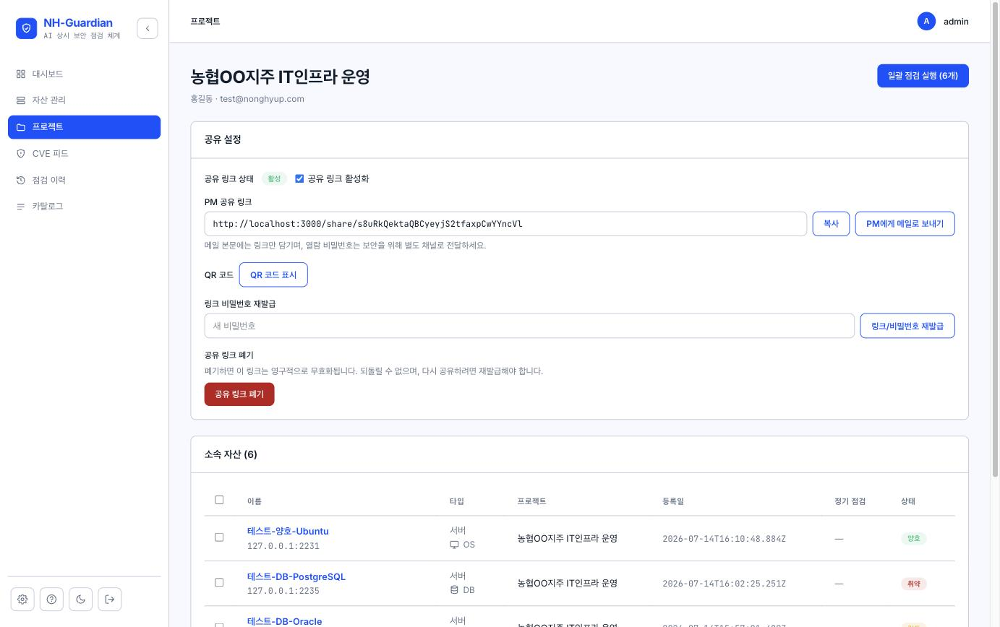

공유 비밀번호는 5회 실패 시 15분 잠금으로 보호되고, 링크는 언제든 폐기·재발급할 수 있습니다.

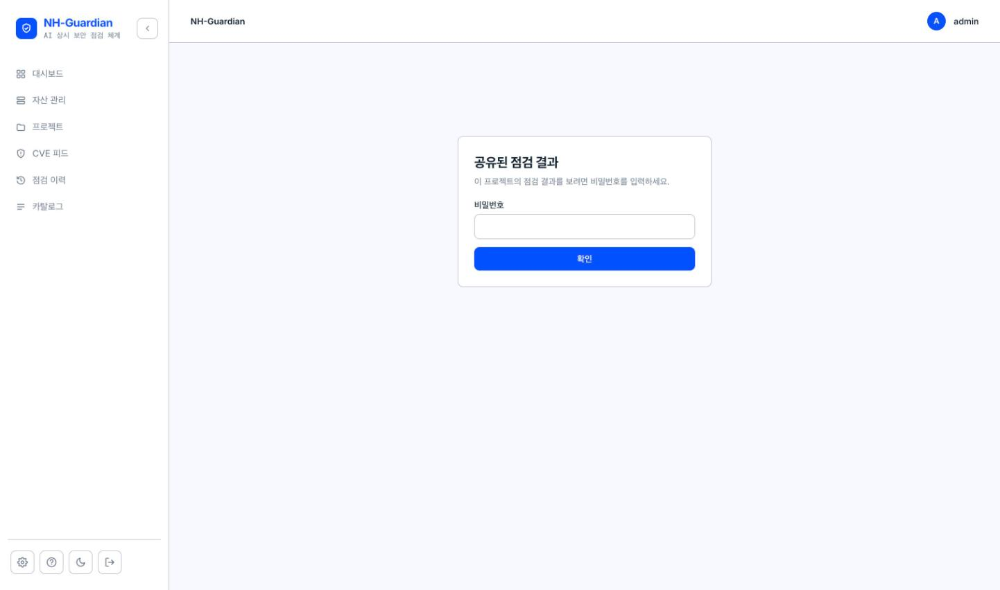

비밀번호를 통과하면 PM은 프로젝트의 **종합 보안 점수 게이지**와 소속 자산 목록을 먼저 만나고, 자산을 골라 관리자와 동일한 양식의 풀 리포트(판정 요약·AI 분석 근거·조치방안)를 읽기 전용으로 열람합니다. 점검을 실행하거나 데이터를 바꿀 수는 없습니다 — 오직 열람만 가능합니다.

**사내망 밖 PM에게 공유하기 (점검자별 고정 링크)** — 공유 링크를 **안 바뀌는 고정 URL**로 만들려면 ngrok 고정 도메인을 쓴다. `.env`에 발급받은 도메인을 넣고 서버와 터널을 띄우면:

```bash
# .env: SHARE_BASE_URL=https://myname.ngrok-free.app
npm run start                                  # NH-Guardian 서버 기동
ngrok http 3000 --url https://myname.ngrok-free.app    # 고정 도메인으로 노출(수동)
```

공유 링크(복사·QR·메일)가 모두 `https://myname.ngrok-free.app/share/<token>` 으로 생성되고, 재실행해도 URL이 바뀌지 않아 PM에게 한 번만 전달하면 됩니다. 점검자가 재점검하면 같은 링크에서 최신 조치가 반영됩니다. 이 공개 도메인으로는 `/share`·`/api/share`만 열리고 로그인·대시보드·내부 API는 404로 차단됩니다(점검자는 localhost로 작업). 다만 이 404는 라우트·API를 가릴 뿐 정적 클라이언트 번들(`/_next/static`)까지 막지는 않으며, 실질적 보호는 관리자 로그인과 공유 비밀번호입니다(다중 방어선). 점검자마다 자기 도메인 = 자기 링크입니다. 자세한 설정은 [ngrok 공유 가이드](docs/ops/share-ngrok.md) 참고. (노트북/터널이 꺼진 시간엔 열람 불가하나 주소는 유지됩니다.)

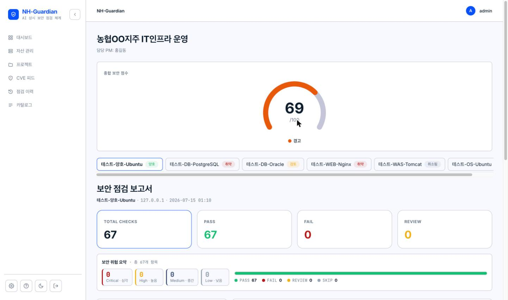

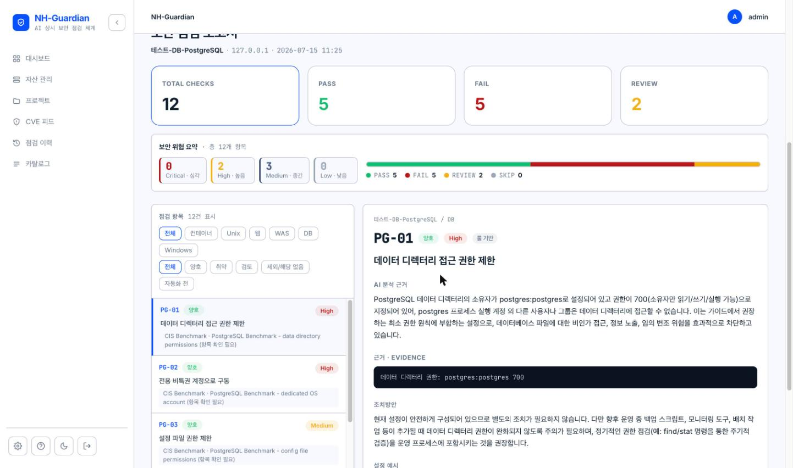

### 10. 처음 써도 헤매지 않게

첫 로그인 시 자산 등록 → 점검 → 진행 확인 → 분석 보고서 → AI 분석 → 실시간 CVE 대응 → 공유로 이어지는 9단계 온보딩 투어가 자동으로 시작됩니다. 다크 모드도 지원합니다.

| 온보딩 투어 | 다크 모드 |
|---|---|
| 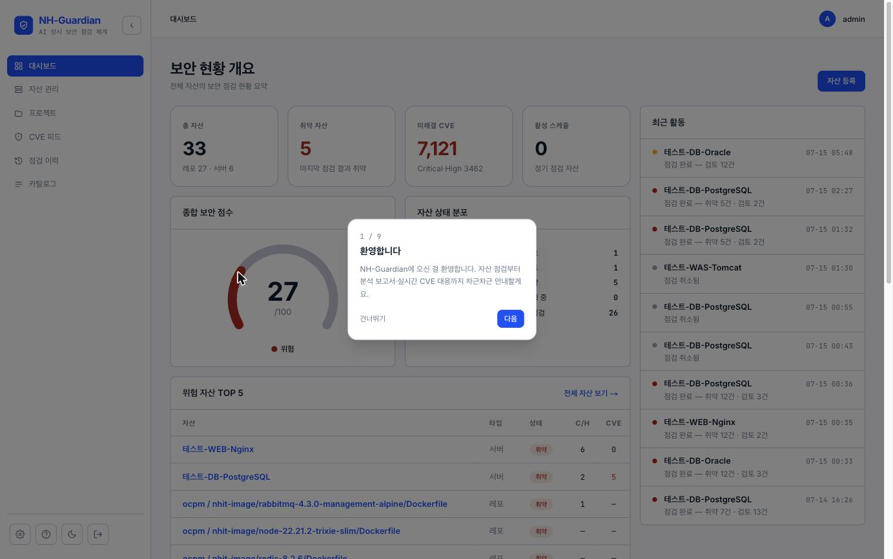 | 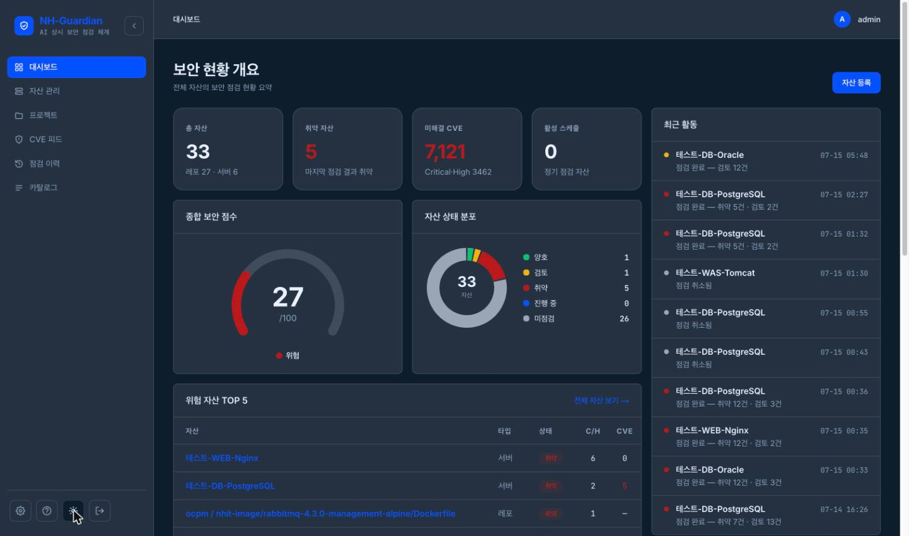 |

---

## 동작 구조

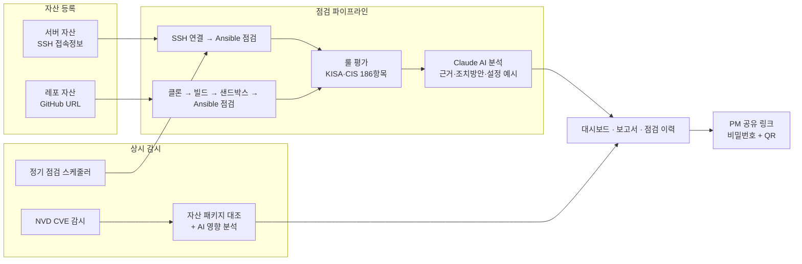
```mermaid
flowchart LR
    subgraph 자산등록["자산 등록"]
        A[서버 자산<br/>SSH 접속정보] 
        B[레포 자산<br/>GitHub URL]
    end
    subgraph 점검["점검 파이프라인"]
        A --> C[SSH 연결 → Ansible 점검]
        B --> D[클론 → 빌드 → 샌드박스 → Ansible 점검]
        C --> E[룰 평가<br/>KISA·CIS 186항목]
        D --> E
        E --> F[Claude AI 분석<br/>근거·조치방안·설정 예시]
    end
    subgraph 상시감시["상시 감시"]
        G[정기 점검 스케줄러] --> C
        H[NVD CVE 감시] --> I[자산 패키지 대조<br/>+ AI 영향 분석]
    end
    F --> J[대시보드 · 보고서 · 점검 이력]
    I --> J
    J --> K[PM 공유 링크<br/>비밀번호 + QR]
```

점검 결과는 다섯 가지 상태로 판정됩니다.

| 상태 | UI 표시 | 의미 |
|---|---|---|
| `pass` | 양호 | 명확한 증거로 기준을 만족 |
| `fail` | 취약 | 명확한 증거로 기준을 위반 |
| `review` | 검토 | 증거 부족·환경 의존으로 수동 확인 필요 |
| `skip` | 제외/해당 없음 | 대상 파일·서비스가 없어 점검 대상 아님 |
| `not_automated` | 자동화 전 | 카탈로그엔 있으나 자동 점검 미지원 (통계 제외) |

---

## 기술 스택

| 영역 | 기술 |
|---|---|
| 프론트/백엔드 | Next.js 16 (App Router) · React 19 · TypeScript strict |
| 데이터베이스 | SQLite (better-sqlite3) — 단일 파일, 별도 DB 서버 불필요 |
| 스타일 | Tailwind CSS v4 · Kinetic Security System 디자인 토큰 (라이트/다크) |
| 점검 엔진 | Ansible playbook (SSH: paramiko/ssh 커넥션) · Docker CLI (샌드박스) |
| AI | Claude API (`@anthropic-ai/sdk`) · zod 응답 스키마 검증 |
| 외부 연동 | NVD API (CVE) · GitHub (레포 클론) · xlsx (엑셀 업로드/템플릿) |
| 백그라운드 | in-process 스케줄러 + CVE 폴러 (`instrumentation.ts` 기동, 외부 큐 불필요) |
| 테스트 | Vitest — **1,159개 테스트 통과** |

인터넷이 차단된 온프레미스 환경을 전제로 설계되어, 담당자 노트북 한 대에서 전체가 동작합니다(외부 의존은 Claude API·NVD API뿐이며 둘 다 꺼도 점검 자체는 동작).

---

## 시작하기

### 요구사항

- Node.js 20+
- `ansible-playbook` CLI (서버/컨테이너 점검 실행)
- Docker CLI (레포·컨테이너 점검 시)
- 점검 대상 서버로의 SSH 접근 (포트는 자산별 설정)

### 권장 사양 · 운영 팁

특히 **레포/이미지 자산 20~30개를 일괄 점검**할 때는 이미지 빌드가 연속으로 일어나므로 아래를 지키는 것을 권장합니다. (디스크 여유 없이 대량 일괄 점검을 돌리면 빌드가 중간에 실패하거나 컨테이너가 강제 종료될 수 있습니다.)

| 항목 | 권장 | 이유 |
|---|---|---|
| 메모리 | 16GB 이상 (Docker에 8GB+ 할당) | 동시 Docker 빌드는 메모리를 많이 씁니다. 기본 동시 빌드 수는 2로 제한되어 있으며(`REPO_SCAN_CONCURRENCY`, 서버 SSH 점검은 별도로 5), 사양이 낮으면 1로 내리고 여유가 있으면 올리세요 |
| 디스크 여유 | 30GB 이상 | 점검용 일회성 이미지(`scan-<runId>`)와 클론 디렉터리는 점검 후 자동 삭제되지만, **내려받은 베이스 이미지와 빌드 레이어 캐시는 Docker에 계속 누적**됩니다. 베이스 이미지가 제각각인 수십 개 Dockerfile을 일괄 점검하면 수십 GB까지 커질 수 있습니다 |
| Docker Desktop 설정 | 가상 디스크 한도 상향 | macOS/Windows는 Docker VM 디스크 한도가 별도라서, 호스트에 여유가 있어도 VM 한도가 차면 빌드가 실패합니다 |

운영 팁:

```bash
# 일괄 점검 전 Docker 저장 공간 상태 확인
docker system df

# 빌드 레이어 캐시·미사용 이미지 정리 (일괄 점검 전후 권장)
docker builder prune -f
docker image prune -f
```

- 대량 일괄 점검 중 일부 자산이 실패해도 실패 격리 덕분에 배치 전체가 중단되지는 않습니다 — 공간 확보 후 실패 자산만 재점검하면 됩니다
- 샌드박스 컨테이너는 10분 수명 제한으로 자동 정리되므로 잔류 컨테이너 걱정은 없습니다
- AI 분석을 켠 상태(`CLAUDE_ANALYSIS_ENABLED=true`)의 일괄 점검은 항목마다 Claude API 호출이 발생해 토큰이 많이 소모됩니다 — 평소엔 꺼두고 필요한 점검에만 켜는 것을 권장합니다

### 설치와 실행

```bash
git clone https://github.com/BoB-Compright/e-Prowler-mvp.git
cd e-Prowler-mvp
npm install

# 환경 변수 설정
cp .env.example .env
```

`.env`에서 다음 값을 설정합니다.

| 변수 | 필수 | 설명 |
|---|---|---|
| `INFRA_SECURITY_MASTER_KEY` | ✅ | SSH 자격증명 암호화용 AES-256 키 (base64 32바이트) |
| `AUTH_ADMIN_USERNAME` / `AUTH_ADMIN_PASSWORD` | ✅(최초 1회) | 최초 기동 시 관리자 계정 자동 생성 (계정이 이미 있으면 무시) |
| `ANTHROPIC_API_KEY` | AI 사용 시 | Claude API 키 |
| `CLAUDE_ANALYSIS_ENABLED` | 선택 | AI 분석 단계 on/off (기본 false — 토큰 절약) |
| `NVD_API_KEY` | 선택 | NVD API 키 (없으면 무키 레이트리밋으로 동작) |
| `DATABASE_PATH` | 선택 | SQLite 파일 경로 (기본 `./data/app.db`) |

암호화 키 생성:

```bash
python3 -c "import secrets, base64; print(base64.b64encode(secrets.token_bytes(32)).decode())"
```

실행:

```bash
# 개발
npm run dev

# 프로덕션
npm run build
npm run start
```

http://localhost:3000 접속 → `/login`에서 관리자 계정으로 로그인하면 온보딩 투어가 시작됩니다. 공유 링크(`/share/[token]`)를 제외한 모든 화면과 API는 로그인이 필요합니다.

테스트:

```bash
npm test   # Vitest — 1,159 tests
```

---

## 보안 설계

- **자격증명 보호**: SSH 비밀번호·키는 AES-256-GCM 암호화 저장. API 응답·로그·AI 입력에 평문 노출 금지. SSH 키는 점검 시에만 0600 임시파일로 복호화되고 실행 직후 삭제
- **인증**: 로컬 계정 + 세션 (scrypt 비밀번호 해시). 설계 근거는 [ADR-0001](docs/adr/0001-authentication-local-accounts.md)
- **공유 링크**: 비밀번호 보호 + 5회 실패 시 15분 잠금 + 영구 폐기/재발급
- **AI 입력 sanitize**: 점검 증거를 Claude에 보내기 전 민감정보 제거
- **리소스 안전장치**: 샌드박스 10분 수명 제한, 일회용 빌드 이미지 자동 삭제, 진행 중 점검이 있는 자산 삭제 차단

---

## 문서

- [PRD v3 (통합 제품 명세)](PRD-v3-integrated.md) — 현행 기능 전체의 상세 명세
- [DESIGN.md](DESIGN.md) — Kinetic Security System 디자인 시스템
- [docs/adr/](docs/adr/) — 아키텍처 결정 기록
- [docs/superpowers/specs/](docs/superpowers/specs/) — 기능별 설계 문서 (40여 편)

---

## 상태

NH Next 20 AI 해커톤 출품작 (2026-07). 내부 전용 도구 — 라이선스 미정의.
